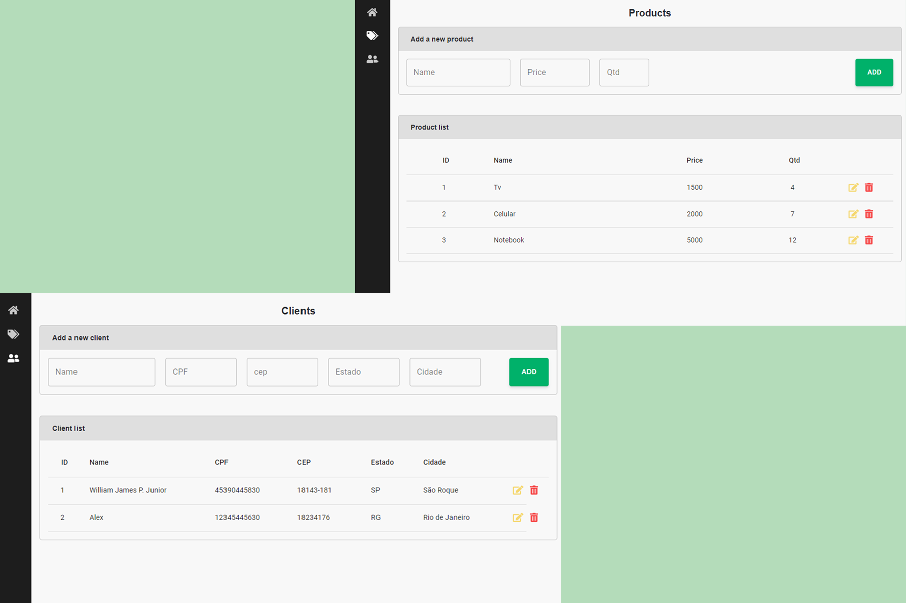

 

  <h3 align="center">CRUD e-commerce</h3>

  

    CRUD para gestão de invertário de produtos e dados de clientes
  

  
Índice

  <ol>
    <li>
      <a href="#sobre-o-projeto">Sobre o projeto</a>
      <ul>
        <li><a href="#construido-com">Construido com</a></li>
      </ul>
    </li>
    <li><a href="#contato">Contato</a></li>
  </ol>

## Sobre o projeto

 
Esse CRUD gerencia o inventário de produtos e dados de clientes. Os dados são salvos no localstorage e podem ser editados e deletados.

Link demo: https://bestclothes.netlify.app

### Construído com

O projeto foi construído utilizando

- [Reactjs](https://reactjs.org)
- [TypeScript](https://www.typescriptlang.org)
- [Material-UI](https://material-ui.com)

## Contato

William James - william.james.pj@gmail.com

Link do projeto: [https://github.com/william-james-pj/crud-ecommerce](https://github.com/william-james-pj/crud-ecommerce)
